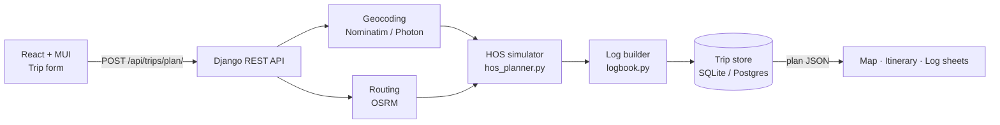

<div align="center">

# 🚛 ELD Trip Planner

**Plan a truck trip, get an FMCSA Hours-of-Service-compliant schedule, and generate filled-in Driver's Daily Log sheets — automatically.**

[](https://www.python.org/)
[](https://www.djangoproject.com/)
[](https://www.django-rest-framework.org/)
[](https://react.dev/)
[](https://mui.com/)
[](https://vitejs.dev/)
[](#-testing)
[](LICENSE)

[**Live App**](https://eld-trip-planner-henna.vercel.app)

</div>

---

## Table of Contents

- [Overview](#-overview)

- [Features](#-features)
- [How It Works](#-how-it-works)
- [Hours-of-Service Rules Implemented](#-hours-of-service-rules-implemented)
- [Tech Stack](#-tech-stack)
- [Getting Started](#-getting-started)
- [Configuration](#-configuration)
- [API Reference](#-api-reference)
- [Deployment](#-deployment)
- [Project Structure](#-project-structure)
- [Design Decisions](#-design-decisions)
- [Testing](#-testing)
- [Known Limitations](#-known-limitations)
- [Roadmap](#-roadmap)
- [Acknowledgements](#-acknowledgements)
- [License](#-license)

---

## 📋 Overview

Commercial truck drivers in the US must log every hour of their day and stay within the FMCSA **Hours of Service (HOS)** limits. Before an ELD (Electronic Logging Device) records the real trip, a dispatcher wants to know: _is this trip legal, where will the driver have to stop, and how many days will it take?_

ELD Trip Planner answers that. Enter four inputs — **current location, pickup, drop-off and hours already used in the cycle** — and the app returns:

1. **The route** on an interactive map with every fuel stop, 30-minute break, 10-hour rest and 34-hour restart marked.
2. **A day-by-day itinerary** with the duty status of every event.
3. **Driver's Daily Log sheets**, one per calendar day, drawn like the official paper form: the stepped duty-status line, per-row totals, remarks at each status change, shipping documents and the 70 hr / 8 day recap. Each sheet exports to PNG.

Everything runs on free, key-less services (OpenStreetMap, OSRM, Nominatim, Photon, CARTO), so it can be cloned and run without any account setup.

## ✨ Features

**Planning**

- Address autocomplete (Photon / OpenStreetMap) with free-text fallback geocoded server-side
- Cycle-hours slider (0–70), configurable trip start time in home-terminal time
- Optional driver, carrier, truck/trailer and home-terminal details printed on the logs
- One-click example trips for quick demos

**Compliance engine**

- Minute-by-minute simulation of the 11-hour driving limit, 14-hour window, 30-minute break, 70 hr / 8 day cycle and 34-hour restart
- Fuel stops at least every 1,000 miles; 1 hour on duty for pickup and for drop-off
- Stops placed at the exact point along the route polyline and reverse-geocoded to "City, ST"

**Results**

- Interactive Leaflet map: separate colours per leg, S/P/D waypoints, numbered stop markers with detail popups, turn-by-turn directions
- Summary cards (distance, driving time, trip duration, delivery time, cycle hours at delivery) and stop counters
- Itinerary grouped by day with duty-status chips
- Daily log sheets rendered as crisp SVG with a remarks table, day tabs and **Download PNG**
- Shareable trip links (`?trip=<uuid>`) and a recent-trips list

**Engineering**

- REST API with request validation and clear 400 errors (unknown address, impossible route, provider outage)
- Response caching for routing and geocoding (in-memory by default, Redis when configured)
- Automated tests for the HOS engine, log builder, routing error handling and API
- Docker / docker-compose, Render and Vercel deployment configs

## ⚙️ How It Works



1. **Geocode** the three locations (skipped when the autocomplete already supplied coordinates).
2. **Route** each leg with OSRM. Driving time is `max(OSRM duration, miles ÷ 60 mph)` so a truck is never assumed to average more than 60 mph on car-profile routing.
3. **Simulate** the drive. Before every driving chunk the planner checks, in order:
   - cycle exhausted → **34-hour restart** (off duty)
   - ≥ 1,000 miles since last fill → **30-minute fuel stop** (on duty)
   - 11-hour driving limit or 14-hour window reached → **10-hour rest** (sleeper berth)
   - 8 hours of driving since the last 30-minute pause → **30-minute break** (off duty)

   Then it drives until the next of: end of leg, fuel due, 11-hour limit, 14-hour window, 8-hour break clock, or cycle limit. Pickup and drop-off add 1 hour on duty each.

4. **Build the logs**: the timeline is split at midnight into 24-hour sheets; totals, remarks (place + activity at every change of duty status) and the rolling 8-day recap are computed, honouring any completed restart.
5. **Store & return** the plan as one JSON document; the frontend renders it and the trip becomes shareable.

## 📏 Hours-of-Service Rules Implemented

Property-carrying driver, 70 hr / 8 day cycle, no adverse driving conditions (as specified by the assessment).

| Rule              | Limit                                  | Behaviour in the planner                                                        |
| ----------------- | -------------------------------------- | ------------------------------------------------------------------------------- |
| Driving limit     | 11 h after 10 consecutive hours off    | Inserts a 10-hour sleeper-berth rest                                            |
| Driving window    | No driving after the 14th hour on duty | Rest is inserted when the window would close; breaks do not extend it           |
| Rest break        | 30 min after 8 h cumulative driving    | Off-duty break; any ≥30-min non-driving period (pickup, fuel) also satisfies it |
| Cycle             | 70 h on duty in 8 days                 | Counts _current cycle used_; inserts a 34-hour restart when exhausted           |
| Fueling           | At least every 1,000 miles             | 30-minute on-duty stop placed on the route                                      |
| Pickup / drop-off | 1 h each                               | On duty (not driving); counts toward the cycle                                  |
| Log recap         | 70 hr / 8 day boxes A, B, C            | Carries prior cycle hours; 60 hr / 7 day boxes marked N/A                       |

## 🧰 Tech Stack

| Layer               | Technology                                                                        |
| ------------------- | --------------------------------------------------------------------------------- |
| Backend             | Python 3.12 · Django 5.2 · Django REST Framework · Gunicorn · WhiteNoise          |
| Database            | SQLite by default; PostgreSQL via `DATABASE_URL`                                  |
| Cache               | Django LocMem by default; Redis via `REDIS_URL`                                   |
| Frontend            | React 18 · Vite 5 · Material UI 6 · Emotion · Axios                               |
| Maps                | React-Leaflet 4 / Leaflet 1.9 · CARTO Voyager tiles                               |
| Routing & geocoding | OSRM (public server) · Nominatim · Photon · optional OpenRouteService HGV profile |
| Tooling             | Docker & docker-compose · Render · Vercel                                         |

## ☁️ Deployment

The live instance runs the **frontend on Vercel** and the **API on Render** (both free tiers). Every push to `main` redeploys both.

## 📁 Project Structure

```
eld-trip-planner/
├── backend/
│   ├── config/                    Django project: settings, urls, wsgi/asgi
│   ├── trips/
│   │   ├── models.py              Trip (UUID id, inputs, summary columns, full plan JSON)
│   │   ├── serializers.py         Request validation (address string or {name, lat, lng})
│   │   ├── views.py               API endpoints
│   │   ├── tests.py               Engine, log builder, routing and API tests
│   │   └── services/
│   │       ├── hos_planner.py     HOS simulation → timeline segments
│   │       ├── logbook.py         Timeline → daily log sheets (totals, remarks, recap)
│   │       ├── routing.py         OSRM / OpenRouteService client, turn-by-turn text
│   │       ├── geocoding.py       Nominatim forward + Photon reverse geocoding (cached)
│   │       └── plan_builder.py    Assembles the API response
│   ├── Dockerfile · render.yaml · vercel.json · requirements.txt · .env.example
├── frontend/
│   ├── src/
│   │   ├── App.jsx                Layout, state, loading/error handling, ?trip= links
│   │   ├── theme.js               MUI theme (navy / amber, IBM Plex)
│   │   ├── api/client.js          Axios client + Photon autocomplete
│   │   ├── utils/format.js        Formatting helpers, colour maps
│   │   └── components/
│   │       ├── TripForm.jsx · LocationAutocomplete.jsx
│   │       ├── SummaryCards.jsx · RouteMap.jsx · Itinerary.jsx · Directions.jsx
│   │       ├── DailyLogs.jsx      Day tabs, PNG download, remarks table
│   │       ├── LogSheet.jsx       The SVG daily log sheet
│   │       └── Header.jsx · EmptyState.jsx · RecentTrips.jsx · SectionTitle.jsx
│   ├── vite.config.js · vercel.json · package.json · .env.example
├── docker-compose.yml
└── README.md
```

## 🧠 Design Decisions

- **Simulation over formulas.** Rather than computing rest stops arithmetically, the planner advances a clock minute by minute and asks "which limit is hit first?" before every chunk of driving. That single loop handles every interaction between the rules (a fuel stop that also satisfies the break rule, a pickup that eats into the 14-hour window, a restart mid-leg) without special cases.
- **Stops on the polyline.** Each intermediate stop's coordinates are interpolated along the OSRM geometry at the correct mileage, then reverse-geocoded in parallel, so map markers and log remarks reflect real places.
- **Logs are data, drawing is presentation.** The API returns each day as segments in minutes-of-day plus totals, remarks and recap; `LogSheet.jsx` only converts segments to an SVG path. The same JSON could drive a PDF exporter or a real ELD display.
- **Home-terminal time, no time zones.** The paper form instructs drivers to use the home terminal's time standard, so the backend works with naive datetimes and the frontend never converts them.
- **Key-less external services** (OSRM, Nominatim, Photon, CARTO) so the project runs from a fresh clone; every response is cached to respect their usage policies.
- **Stored plans.** Every plan is persisted with a UUID, giving shareable links and a recent-trips list for free.

## 🧪 Testing

```bash
cd backend
python manage.py test
```

Ten tests cover:

- **HOS engine** — short trips need no stops; long trips respect the 11 h / 14 h / 8 h limits with contiguous segments; fuel stops every 1,000 miles; total miles preserved; a 69.5-hour cycle forces a 34-hour restart after ≤ 30 minutes of driving; a 70-hour cycle restarts before driving at all.
- **Log builder** — every sheet sums to exactly 1,440 minutes; recap arithmetic carries prior cycle hours.
- **Routing errors** — OSRM `NoRoute` / `NoSegment` responses are reported as routing problems, server errors as outages.
- **API** — plan → fetch by id → list, with routing mocked; validation errors return 400.

## ⚠️ Known Limitations

- OSRM's public server uses a car profile; the 60 mph cap approximates truck speeds but does not account for truck-restricted roads. Set `ROUTING_PROVIDER=ors` with an OpenRouteService key for the HGV profile.
- The public OSRM / Nominatim / Photon servers are rate-limited and occasionally slow; results are cached to minimise calls.
- On Render's free tier the SQLite database is reset on each deploy, so old share links expire. Configure `DATABASE_URL` for persistence.
- The planner models property-carrying drivers only (no passenger-carrying, adverse-conditions, short-haul or split-sleeper exceptions).

## Acknowledgements

[OpenStreetMap](https://www.openstreetmap.org/) contributors · [Project OSRM](https://project-osrm.org/) · [Nominatim](https://nominatim.org/) · [Photon](https://photon.komoot.io/) · [CARTO](https://carto.com/) basemaps · [FMCSA Hours of Service regulations](https://www.fmcsa.dot.gov/regulations/hours-service/summary-hours-service-regulations)

## License

This project is licensed under the [MIT License](LICENSE).
